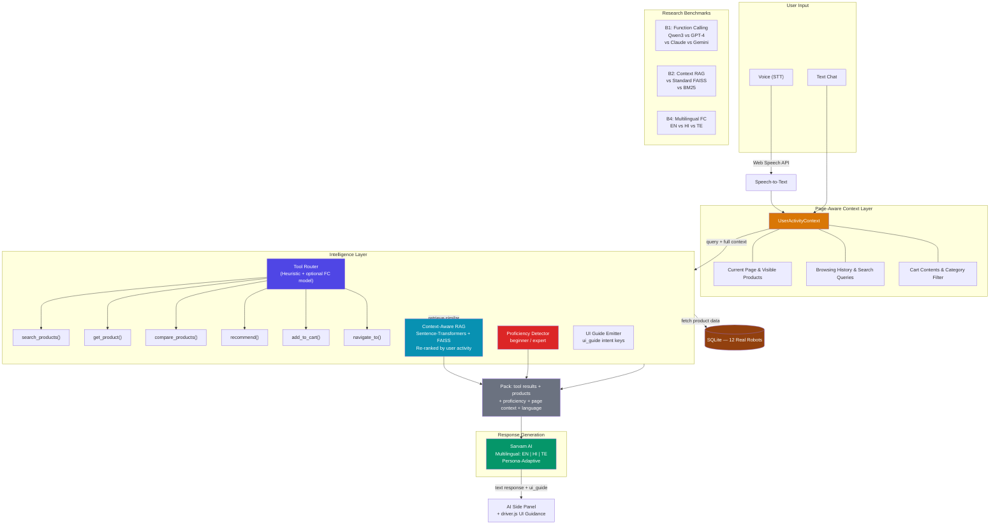

# Nexus Bots

**Domain-Specific Function Calling with Fine-Tuned Small LLMs and Context-Aware RAG for Persona-Adaptive Multilingual Robotics Commerce**

> Course Project — Topics in Deep Learning (CS6420), IIT Hyderabad

## Abstract

We present Nexus Bots, a robotics commerce platform that investigates whether a fine-tuned small language model (~0.8B parameters) can match large models (GPT-4, Claude, Gemini) at domain-specific function calling — selecting the right tool and generating correct arguments for robotics e-commerce queries. The system combines: (1) a QLoRA-fine-tuned Qwen3.5-0.8B for structured function calls, (2) context-aware RAG re-ranked by real-time user activity, (3) automatic user proficiency detection for persona-adaptive responses via Sarvam AI, and (4) LLM-driven UI guidance that highlights on-screen elements to walk users through multi-step flows. We benchmark across English, Hindi, and Telugu.

## System Architecture



## Product Catalog

12 real-world robots from actual companies across 4 categories:

| Category | Count | Products (Real Brands) |
|---|---|---|
| **Kitchen** | 3 | Amazon Astro, Samsung Ballie, Enabot EBO X |
| **Home Cleaner** | 3 | iRobot Roomba j9+, Roborock S8 MaxV Ultra, Ecovacs WINBOT W2 Omni |
| **Drone** | 3 | Ring Always Home Cam, DJI Matrice 30T, Aiper Surfer S1 |
| **Humanoid** | 3 | Miko 3, Wonder Workshop Dash, LEGO Education Spike Prime |

## Function Calls (6 Tools)

The pipeline routes user queries to these domain-specific tools:

| Function | Description | Example |
|---|---|---|
| `search_products(query, category)` | Search/filter the catalog | `search_products("pool cleaner", "Home Cleaner")` |
| `get_product(id)` | Get detailed product info | `get_product(8)` |
| `compare_products(id1, id2, focus)` | Compare two products | `compare_products(5, 6, "suction")` |
| `recommend(need, budget, category)` | Get recommendations | `recommend("kids coding", 300, "Humanoid")` |
| `add_to_cart(id)` | Add product to cart | `add_to_cart(10)` |
| `navigate_to(page, params)` | Guide user to a page | `navigate_to("catalog", {category: "Drone"})` |

## Tech Stack

| Layer | Technology |
|---|---|
| Frontend | React 19 + Vite + Tailwind CSS 4 |
| Backend | Node.js + Express 5 |
| Database | SQLite (better-sqlite3) |
| Function Calling | Heuristic router + Qwen3.5-0.8B base (ChatML, GPU/CPU) |
| Retrieval | Sentence-transformers + FAISS (context-aware re-ranking) |
| Orchestration | Direct Python dispatch (pipeline.py ↔ ai.js via JSON-line IPC) |
| Reasoning/Response | Sarvam AI (EN/HI/TE, persona-adaptive) |
| UI Guidance | driver.js (MIT, 5 KB) with CSS pulse animations |
| Voice | Web Speech API (STT only) |
| Training | Google Colab (T4) + Unsloth + HuggingFace |

## Project Structure

```
nexus-bots/
├── client/                # React frontend (Vite + Tailwind)
│   ├── src/
│   │   ├── components/    # Navbar, Footer, AISidePanel, CartDrawer, ParticleNetwork
│   │   ├── context/       # UserActivityContext (views, cart, search, page)
│   │   ├── pages/         # Home, Catalog, RobotDetail, OrderHistory
│   │   ├── ui-guide/      # driver.js flows, UIGuideProvider, guide-pulse.css
│   │   ├── data/          # robots.js — 12 real-world robots
│   │   ├── styles/        # tokens.css (design tokens)
│   │   └── utils/         # user.js (userId persistence)
├── server/                # Node.js backend
│   ├── ai/                # pipeline.py, sarvam_client.py, fc_model.py (Python workers)
│   ├── config/            # db.js (SQLite)
│   ├── database/          # schema.sql, seed.sql, init.js
│   ├── models/            # Product.js, Chat.js, Order.js, CallbackRequest.js
│   ├── routes/            # products.js, chats.js, orders.js, ai.js
│   └── index.js
├── finetune/              # Fine-tuning infrastructure
│   ├── data/              # train.jsonl, test.jsonl (v2 with ui_guide)
│   ├── eval/              # bench_function_calling.py, bench_rag.py
│   ├── config.py, train.py, inference.py
│   └── integration/       # fc_model.py (model integration module)
├── research/              # Dataset generation scripts & schemas
├── Idea.md                # Full project motivation & research questions
├── PLAN.md                # 24-hour execution plan
└── README.md
```

## Getting Started

```bash
git clone <repo-url>
cd NexusBots-TDL-Project

# Frontend
cd client && npm install && npm run dev

# Backend (new terminal)
cd server && npm install && npm run init-db && npm run dev

# Python AI dependencies (optional — for Sarvam + RAG)
cd server/ai && pip install -r requirements.txt
```

- Frontend: **http://localhost:5173**
- Backend: **http://localhost:5000**

## Key Features

### AI Side Panel
Slide-out assistant accessible from "Ask AI" in the navbar. Supports text + voice input (auto-detects language via Web Speech API), shows product cards inline, and triggers UI guidance flows.

### UI Guidance System
When the AI recommends navigation (e.g., "check your orders"), driver.js highlights the relevant UI elements with pulsing spotlights and auto-navigates across pages. 11 pre-defined flows covering orders, cart, catalog categories, and support.

### Context-Aware Responses
The AI knows what page the user is on, what they've browsed, what's in their cart, and adapts responses accordingly. Product recommendations are re-ranked by user activity signals.

### Persona-Adaptive Generation
Automatic proficiency detection (beginner vs expert) adjusts Sarvam's response complexity — technical specs for experts, friendly explanations for beginners.

## Build Status

- [x] Phase 1 — Premium UI (Home, Catalog, RobotDetail, OrderHistory, Navbar, CartDrawer, AISidePanel, UIGuide system)
- [x] Phase 2 — Backend Polish (PipelineRuntime singleton, subprocess reuse, correctness fixes, ui_guide emission, rate limiting, .env config)
- [x] Phase 3 — Model Integration (Qwen3.5-0.8B base model via ChatML, fc_model.py, Sarvam AI response generation, semantic RAG enabled)
- [ ] Phase 4 — Fine-Tune + Benchmarks (Qwen3.5-0.8B LoRA adapter, B1/B2/B4 benchmark tables)
- [ ] Phase 5 — Demo + Submission (video, slides, README refresh with real numbers)

## Benchmark Tables (Phase 3 — TBD)

### B1 — Function-Calling Accuracy
| System | Tool Acc | Arg F1 | p50 Latency | $/1000 |
|---|---|---|---|---|
| Qwen3.5-0.8B-FC (ours) | — | — | — | ~$0 |
| Heuristic router | — | — | ~1 ms | $0 |
| GPT-4o zero-shot | — | — | — | — |
| Claude Opus 4.7 zero-shot | — | — | — | — |
| Gemini 2.5 zero-shot | — | — | — | — |

### B2 — Context-Aware RAG
| Method | Recall@3 | MRR |
|---|---|---|
| FAISS + context re-rank (ours) | — | — |
| FAISS only | — | — |
| BM25 | — | — |

### B4 — Multilingual Function-Calling
| Language | Qwen3.5-0.8B-FC Acc | Best Frontier Acc |
|---|---|---|
| English | — | — |
| Hindi | — | — |
| Telugu | — | — |

## Team

**Digvijaysing Rajput** (CS24MTECH14020), **Vinay Kadari** (CS24MTECH14008)

---

*Academic project — IIT Hyderabad, M.Tech, CS6420 Topics in Deep Learning*
