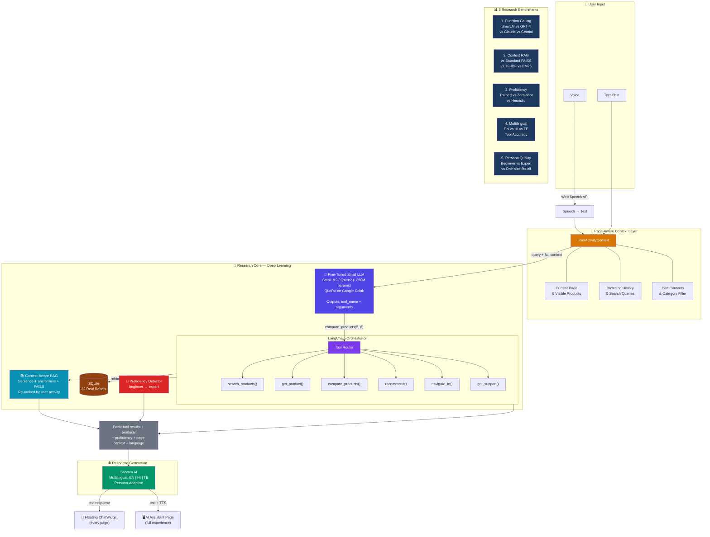

# Nexus Bots

**Domain-Specific Function Calling with Fine-Tuned Small LLMs and Context-Aware RAG for Persona-Adaptive Multilingual Robotics Commerce**

> Course Project — Topics in Deep Learning (CS6420), IIT Hyderabad

## Abstract

We present Nexus Bots, a robotics commerce platform that investigates whether a fine-tuned small language model (~360M parameters) can match large models (GPT-4, Claude, Gemini) at domain-specific function calling — selecting the right tool and generating correct arguments for robotics e-commerce queries. The system combines: (1) a QLoRA-fine-tuned SmolLM2/Qwen2 for structured function calls, (2) context-aware RAG re-ranked by real-time user activity, and (3) automatic user proficiency detection for persona-adaptive responses via Sarvam AI, orchestrated by LangChain. We benchmark across English, Hindi, and Telugu.

## System Architecture



## Product Catalog

22 real-world robots from actual companies across 6 categories:

| Category | Count | Products (Real Brands) |
|---|---|---|
| **Household** | 4 | Amazon Astro, Samsung Ballie, Enabot EBO X, Unitree Go2 Air |
| **Home Cleaner** | 4 | iRobot Roomba j9+, Roborock S8 MaxV Ultra, Ecovacs WINBOT W2, Aiper Surfer S1 |
| **Child** | 3 | Miko 3, Wonder Workshop Dash, LEGO Spike Prime |
| **Educational** | 4 | DJI RoboMaster S1, TurtleBot 4, Makeblock mBot2, Unitree Go2 EDU |
| **Security** | 3 | Ring Always Home Cam, Xiaomi CyberDog 2, DJI Matrice 30T |
| **Industrial** | 4 | Universal Robots UR10e, Boston Dynamics Stretch, FANUC CRX-25iA, ABB YuMi |

## Tech Stack

| Layer | Technology |
|---|---|
| Frontend | React 19 + Vite + Tailwind CSS |
| Backend | Node.js + Express |
| Database | SQLite (better-sqlite3) |
| Function Calling | Fine-tuned SmolLM2/Qwen2 (QLoRA, ~360M) |
| Retrieval | Sentence-transformers + FAISS (context-aware) |
| Orchestration | LangChain |
| Reasoning | Sarvam AI (EN/HI/TE) |
| Voice | Web Speech API + TTS |
| Training | Google Colab + Unsloth + HuggingFace |

## Project Structure

```
nexus-bots/
├── client/                # React frontend (Vite + Tailwind)
│   ├── src/
│   │   ├── components/    # Navbar, Footer, RobotCard, HeroSection, ChatWidget
│   │   ├── context/       # UserActivityContext (views, cart, search, page)
│   │   ├── pages/         # Home, Catalog, RobotDetail, AIAssistant, Support
│   │   ├── data/          # robots.js — 22 real-world robots
│   │   └── styles/
├── server/                # Node.js backend
│   ├── config/            # db.js (SQLite)
│   ├── database/          # schema.sql, seed.sql, init.js
│   ├── models/            # Product.js, Chat.js
│   ├── routes/            # products.js, chats.js, ai.js
│   └── index.js
├── research/              # DL research component
│   ├── dataset/           # Function-calling dataset (EN/HI/TE)
│   ├── notebooks/         # Colab notebooks (fine-tuning, RAG, benchmarks)
│   ├── models/            # Saved model weights
│   └── results/           # Benchmark tables and charts
├── Idea.md
├── PLAN.md
└── README.md
```

## Getting Started

```bash
git clone <repo-url>
cd NexusBots-TDL-Project

# Node.js runtime (required)
# Recommended: nvm + Node 20
nvm install
nvm use

# Frontend
cd client && npm install && npm run dev

# Backend (new terminal)
cd server && npm install && npm run init-db && npm run dev
```

- Frontend: **http://localhost:5173**
- Backend: **http://localhost:5000**

## Build Status

- [x] Phase 1 — UI + Backend (React + Tailwind, Express + SQLite, 22 real robots, ChatWidget, AI Assistant, context tracking)
- [ ] Phase 2 — Research Core (dataset, fine-tune small LLM, proficiency classifier, context-aware RAG)
- [ ] Phase 3 — Integration (LangChain + Sarvam + frontend pipeline)
- [ ] Phase 4 — Voice + Evaluation + Demo

## Team

**Digvijaysing Rajput** (CS24MTECH14020), **Vinay Kadari** (CS24MTECH14008)

---

*Academic project — IIT Hyderabad, M.Tech, CS6420 Topics in Deep Learning*
