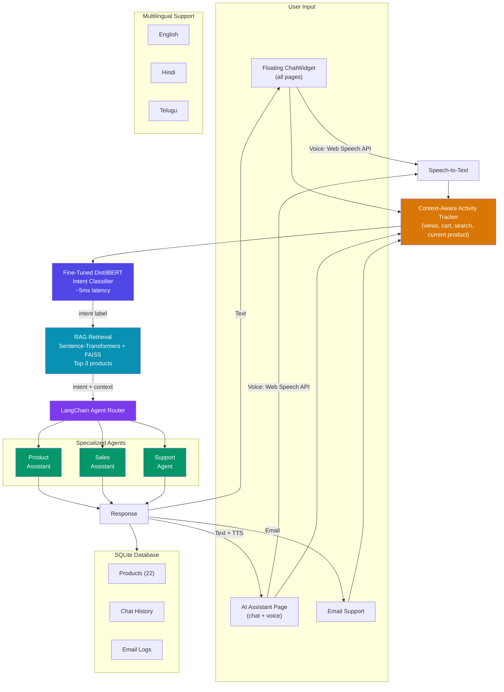
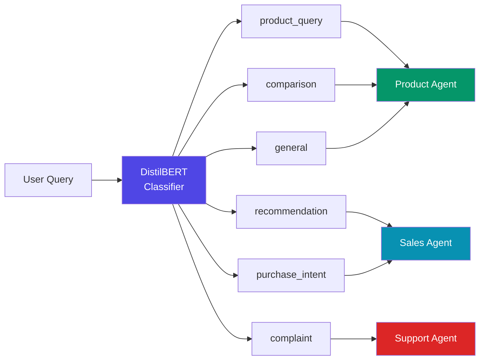
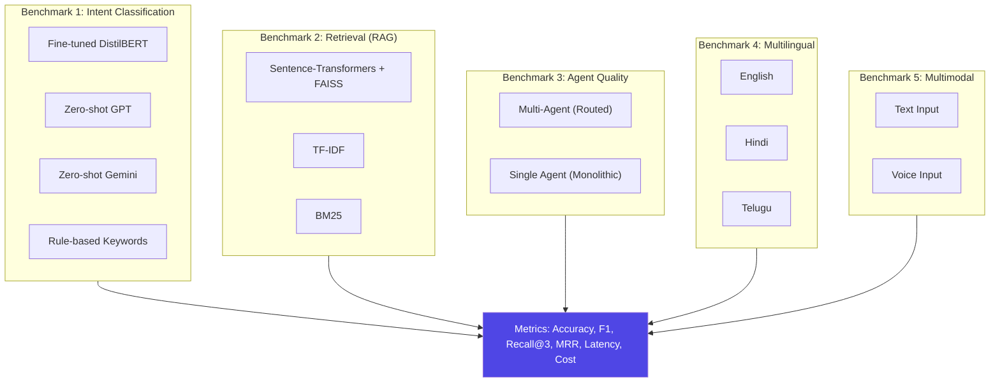

# Nexus Bots

**Fine-Tuned Intent Routing and RAG-Based Retrieval for Multilingual Multi-Agent Robotics Commerce**

> Course Project — Topics in Deep Learning (CS6420), IIT Hyderabad

## Abstract

Multi-agent AI systems in e-commerce typically rely on large language model API calls for both intent routing and context retrieval, which can be slow and costly for real-time use. We present Nexus Bots, a robotics commerce platform that combines a fine-tuned DistilBERT intent classifier for agent routing with retrieval-augmented generation (RAG) using sentence-transformer embeddings for product-aware responses. The system routes user queries across chat, voice, and email channels to specialized LangChain agents including product assistant, sales, and support agents, while RAG retrieves relevant product context from a catalog of 22 real-world robots across 6 categories. We fine-tune DistilBERT on a domain-specific dataset of labeled e-commerce queries across 6 intent classes and benchmark it against zero-shot GPT, Gemini, and rule-based keyword matching on accuracy, F1, latency, and cost. We also compare RAG retrieval approaches (sentence-transformers vs TF-IDF vs BM25) on recall and relevance. Additionally, we evaluate whether routing to specialized agents produces better responses than a single monolithic chatbot. As a case study, we test multilingual intent classification on English, Hindi, and Telugu queries, and compare intent accuracy across text and voice input modalities.

## System Architecture



## Intent Classification Pipeline



## Research Benchmarks



## Product Catalog

22 real-world robots from actual companies across 6 categories:

| Category | Count | Products (Real Brands) |
|---|---|---|
| **Household** | 4 | Amazon Astro, Samsung Ballie, Enabot EBO X, Unitree Go2 Air |
| **Home Cleaner** | 4 | iRobot Roomba j9+, Roborock S8 MaxV Ultra, Ecovacs WINBOT W2, Aiper Surfer S1 |
| **Child** | 3 | Miko 3, Wonder Workshop Dash, LEGO Spike Prime |
| **Educational** | 4 | DJI RoboMaster S1, TurtleBot 4, Makeblock mBot2, Unitree Go2 EDU |
| **Security** | 3 | Ring Always Home Cam, Xiaomi CyberDog 2, DJI Matrice 30T |
| **Industrial** | 4 | Universal Robots UR10e, Boston Dynamics Stretch, FANUC CRX-25iA, ABB YuMi |

All data uses real product names, real specifications, and real pricing from official sources.

## Context-Aware Bot

The system tracks user activity through React Context and provides proactive assistance:

- **Viewed products** — what the user has clicked on
- **Cart contents** — what they've added to cart
- **Current product** — what they're looking at right now
- **Search queries** — what they've searched for
- **Category filter** — what category they're browsing

This enables context-aware responses like:
- *"I see you're looking at the Roomba j9+ — want to compare it with the Roborock S8?"*
- *"You have 2 items in your cart. Ready to checkout?"*

## Tech Stack

| Layer | Technology |
|---|---|
| Frontend | React 19 + Vite + Tailwind CSS |
| Backend | Node.js + Express |
| Database | SQLite (`better-sqlite3`) |
| AI Routing | Fine-tuned DistilBERT (HuggingFace) |
| AI Retrieval | Sentence-transformers + FAISS |
| AI Agents | LangChain + OpenAI |
| Voice | Web Speech API + TTS |
| Email | Nodemailer + AI agent |

## Project Structure

```
nexus-bots/
├── client/                # React frontend (Vite + Tailwind)
│   ├── src/
│   │   ├── components/    # Navbar, Footer, RobotCard, HeroSection, FeaturedRobots, ChatWidget
│   │   ├── context/       # UserActivityContext (views, cart, search tracking)
│   │   ├── pages/         # Home, Catalog, RobotDetail, AIAssistant, Support
│   │   ├── data/          # robots.js — 22 real-world robot products
│   │   └── styles/
│   └── public/            # favicon, icons
├── server/                # Node.js backend
│   ├── config/            # db.js (SQLite connection)
│   ├── database/          # schema.sql, seed.sql, init.js, nexusbots.db
│   ├── models/            # Product.js, Chat.js
│   ├── routes/            # products.js, chats.js
│   └── index.js           # Express server entry
├── research/              # Research component (Phase 3+)
│   ├── dataset/           # Labeled intent dataset (EN + HI + TE)
│   ├── notebooks/         # Colab training notebooks
│   ├── models/            # Saved fine-tuned model
│   └── results/           # Benchmark tables and charts
├── Idea.md
├── PLAN.md
└── README.md
```

## Getting Started

```bash
git clone <repo-url>
cd NexusBots-TDL-Project

# 1) Frontend
cd client
npm install
npm run dev

# 2) Backend (new terminal)
cd ../server
npm install
npm run init-db    # Creates SQLite DB and seeds 22 robots
npm run dev
```

- Frontend: **http://localhost:5173**
- Backend API: **http://localhost:5000**

## Backend API

| Method | Endpoint | Description |
|---|---|---|
| `GET` | `/api/health` | Health check |
| `GET` | `/api/products` | All products (`?category=Security`, `?search=vacuum`) |
| `GET` | `/api/products/:id` | Single product by ID (includes brand) |
| `POST` | `/api/chats` | Create new chat session |
| `GET` | `/api/chats/:id` | Get chat session with messages |
| `POST` | `/api/chats/:id/messages` | Add message to chat |

## Pages & Navigation

| Nav Item | Route | Description |
|---|---|---|
| Home | `/` | Hero section, featured robots, AI feature cards, stats |
| Products | `/catalog` | Full catalog with search, category filter, sorting |
| AI Assistant | `/assistant` | Combined chat + voice full-page experience |
| Support | `/support` | Email support form with AI agent |
| — | (floating widget) | Bottom-right chatbot available on ALL pages |

The floating ChatWidget is context-aware — it knows what product the user is viewing, what's in their cart, and what they've browsed, and can proactively offer help.

## Build Status

- [x] Phase 1 — UI Foundation (React + Tailwind, responsive, mobile nav, floating ChatWidget, AI Assistant page)
- [x] Phase 2 — Backend + Database (Express + SQLite, product + chat APIs, 22 real robots seeded)
- [ ] Phase 3 — Intent Classification + Multilingual Benchmarks
- [ ] Phase 4 — RAG Pipeline + Retrieval Benchmarks
- [ ] Phase 5 — LangChain Multi-Agent System
- [ ] Phase 6 — Full Integration (ChatWidget + AI Assistant → backend pipeline)
- [ ] Phase 7 — Voice Interaction (Multimodal)
- [ ] Phase 8 — Email Support
- [ ] Phase 9 — Polish & Demo

## Team

**Digvijaysing Rajput** (CS24MTECH14020), **Vinay Kadari** (CS24MTECH14008)

---

*Academic project — IIT Hyderabad, M.Tech, CS6420 Topics in Deep Learning*
